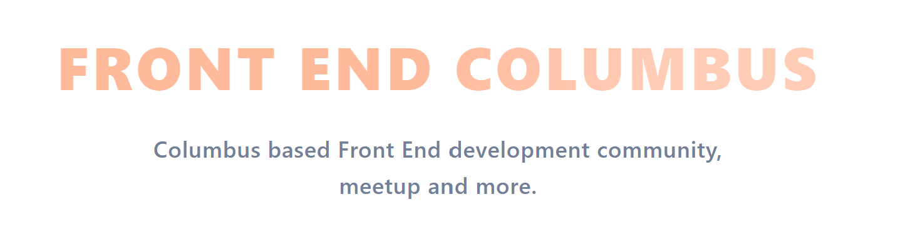

> Hey there! This is the website for the Columbus based Front End developer community. 

[](https://app.netlify.com/sites/nifty-pare-29e1ff/deploys)

## V1 To-Do
- [x] Homepage
- [x] Dynamic homepage CTAs
- [x] Event listing page
- [x] Event details page
- [ ] Job post list
- [ ] Job details page
- [x] Discord signup link
- [x] CFP form
- [ ] PR documentation and templates for job postings & events

## Adding job postings

To submit a job posting, please create a Markdown file in `/content/jobs` with the details of position. See other job postings as an example. Create a pull request to have the posting added to the website!

## Build Setup

```bash
# install dependencies
$ npm install

# serve with hot reload at localhost:3000
$ npm run dev

# build for production and launch server
$ npm run build
$ npm run start

# generate static project
$ npm run generate
```

For detailed explanation on how things work, check out [Nuxt.js docs](https://nuxtjs.org).
